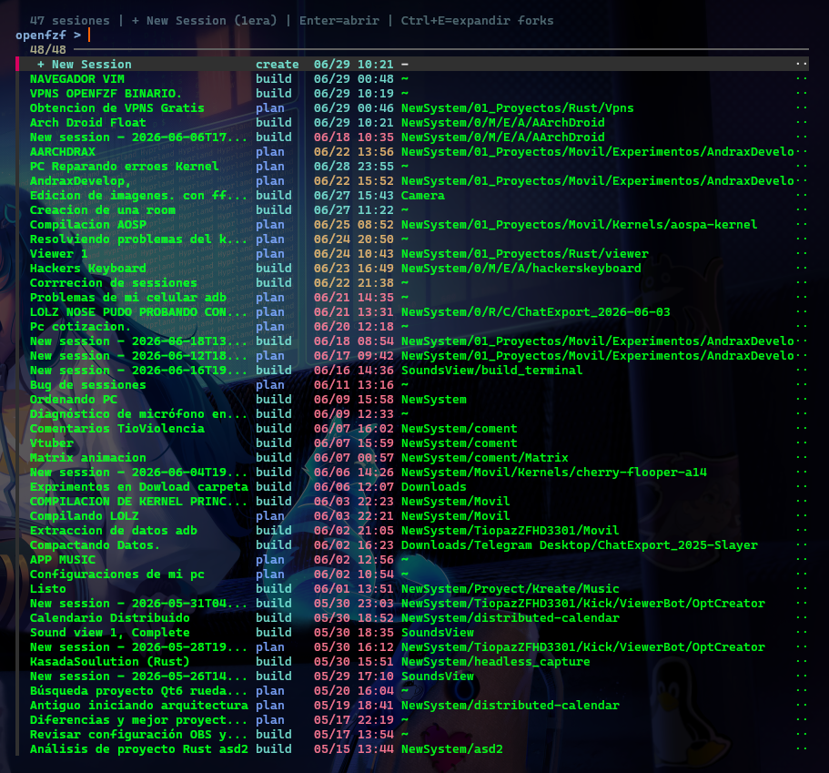
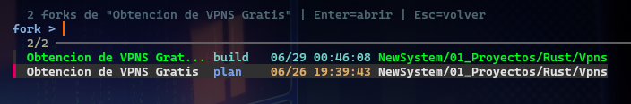
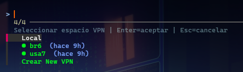

# openfzf — OpenCode Session Browser

Tired of losing track of your OpenCode sessions? Forgot which directory you were working on? Lost that important fork you created hours ago?

**openfzf** is a fzf-powered TUI that organizes, filters, and launches every OpenCode session on your machine. No more duplicate sessions, no more guessing which project is which — everything in one place, beautifully presented.

## Screenshots


*Main session list (level 1) showing deduplicated sessions grouped by title, with agent type, color-coded timestamps (green <2d, yellow <7d, red >7d), directory, VPN tag, and fork count. The "+ New Session" entry is always on top.*


*Fork expansion (level 2) showing all individual sessions for a given title. Accessed via Ctrl+E from level 1. Each entry shows the full timestamp, agent, and directory. Press Esc to return to level 1.*


*VPN namespace selector with three states: Local (host), running namespaces (● green = VPN connected, ○ red = VPN offline), and "Crear New VPN" to create a new namespace inline. Inactive namespaces appear dimmed and cannot be selected.*

## Features

- **Two-level session browser** — list deduplicated sessions (level 1), expand forks (level 2) with Ctrl+E
- **Agent filtering** — show only `build`/`plan` by default; `--all`, `--plan`, `--build`, `--explore`, `--general`
- **VPN namespace selector** — pick Local or an existing VPN namespace; create new VPNs inline
- **Recency ordering** — sessions opened last appear first (tiny SQLite cache at `~/.cache/openfzf/opened.db`)
- **Color-coded dates** — green <2d, yellow <7d, red >7d (based on `time_updated`)
- **Adaptive columns** — title/dir widths auto-adjust to terminal size
- **Kitty integration** — opens sessions in new OS windows (Local) or terminals inside namespaces
- **Persistent menu** — fzf stays open after launching a session; Esc in level 2 returns to level 1
- **`--no-vpn` flag** — skip the space selector entirely, always open locally
- **VPN auto-detection** — detects active VPN namespaces with `tun0` and tags sessions with a green "VPN" label

## Requirements

- Bash 4+
- [fzf](https://github.com/junegunn/fzf)
- [OpenCode](https://opencode.ai)
- SQLite3 (for session DB + recency cache)
- sudo with NOPASSWD (for namespace operations)
- kitty (optional, for terminal launching)
- iproute2, iptables, openvpn, socat (optional, for VPN creation)

## Installation

```bash
cp openfzf ~/.local/bin/
chmod +x ~/.local/bin/openfzf
```

## Usage

```bash
openfzf                         # default: show build/plan sessions
openfzf --all                   # show all agents
openfzf --plan                  # only plan sessions
openfzf --build                 # only build sessions
openfzf --explore               # only explore sessions
openfzf --general               # only general sessions
openfzf --no-vpn                # skip VPN space selector
openfzf --no-vpn --plan         # combine flags
```

### Key bindings

| Key | Action |
|---|---|
| Enter | Open selected session |
| Ctrl+E | Expand forks of selected session (show level 2) |
| Esc (level 1) | Exit |
| Esc (level 2) | Return to level 1 |
| Tab (New Session) | Create a new OpenCode session |

### VPN flow

1. After selecting a session, a space selector appears:
   - `Local` — open directly on the host
   - `● namespace` — namespace is running and VPN is connected
   - `○ namespace` — namespace exists but VPN is disconnected
   - `Crear New VPN` — create a new VPN namespace (select .ovpn, auto-name, start)
2. Inactive namespaces (dimmed) cannot be selected.
3. When a namespace is chosen, opencode runs inside it via:
   ```
   sudo ip netns exec <ns> runuser -u <user> -- opencode --session <id>
   ```
4. `fzf` stays open after launching; press Esc to navigate back.

## Architecture

```
openfzf
├── Level 1 (build_l1)
│   SQL: GROUP BY canonical_title, ordered by last_opened DESC
│   Shows: title, agent, date, directory, VPN tag, fork count
│   "+ New Session" always at top
│
├── Level 2 (build_l2 / gen_l2_entries)
│   SQL: WHERE title LIKE 'canonical%', ordered by last_opened DESC
│   Shows: title, agent, date+time, directory
│
├── Space selector (select_space)
│   fzf menu: Local / running namespaces / Crear New VPN
│   Dimmed entries cannot be selected (loop re-shows selector)
│
└── Session launcher (open_session / new_session)
    ├── Local → kitty @ launch --type=os-window (new window)
    └── Namespace → kitty --hold + sudo ip netns exec ... opencode
```

### Recency cache

A small SQLite database at `~/.cache/openfzf/opened.db` tracks session open times:

```sql
CREATE TABLE opened (id TEXT PRIMARY KEY, last_opened INTEGER);
```

The main OpenCode DB (at `~/.local/share/opencode/opencode.db`) is ATTACHed and LEFT JOINed — no data is duplicated.

## Configuration

### Environment variables

| Variable | Default | Description |
|---|---|---|
| `OPENFZF_ALL` | empty | Show all sessions (skip dedup, flat list) |
| `OPENFZF_DEBUG` | empty | Print debug info to stderr |
| `OPENFZF_LOG` | empty | Write debug log to file |
| `VPN_TIMEOUT` | 30 | Seconds to wait for tun0 when creating a VPN |

### Config files

| Path | Purpose |
|---|---|
| `~/.local/share/opencode/opencode.db` | OpenCode session database |
| `~/.cache/openfzf/opened.db` | Recency cache |
| `~/.config/vpns/spaces` | VPN namespace registry (created by vpns) |
| `~/Downloads/VPNS/*.ovpn` | OpenVPN config files |

## Troubleshooting

**fzf doesn't open:** ensure `fzf` is installed and you're in a terminal (not piped).

**"Cannot open network namespace" with extra text:** the `select_space` parser uses `cut -d'|' -f1`. Make sure you have the latest version.

**VPN creation fails:** check that OpenVPN configs exist in `~/Downloads/VPNS/`, that `sudo` has NOPASSWD, and that `openvpn` is installed.

**Session doesn't appear in list:** the default filter only shows `build` and `plan` agents. Use `--all` to see everything.

**Port conflicts in namespace:** each namespace uses a unique subnet (10.200.N.0/24). Multiple namespaces can run simultaneously without conflicts.
